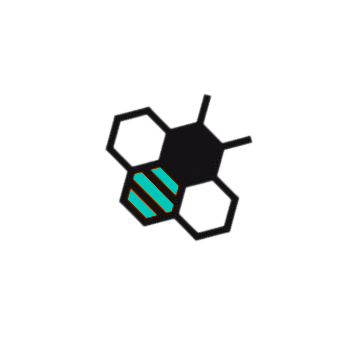

#  DevHive

### 🚀 A Collaborative Hub for Web Development

🌐 **Main Website:**

📄 **Individual Web Pages:**

---

## 📌 About DevHive
Welcome to **DevHive's** Github Repository! We are a group of dedicated students
that creates beautiful functional websites for our course subject
Web Development!

---

## 🔧 Language Used

---

## 📅 Deadline

